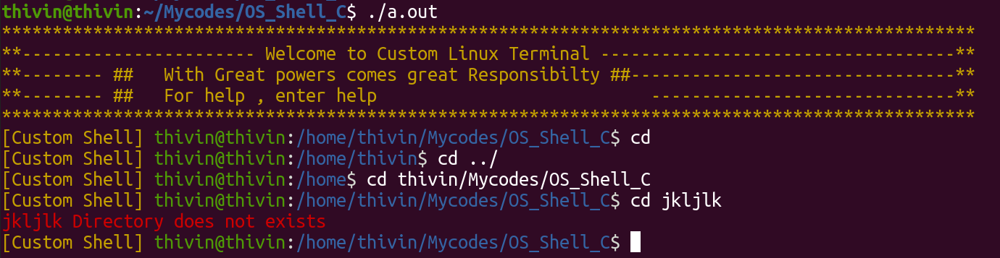
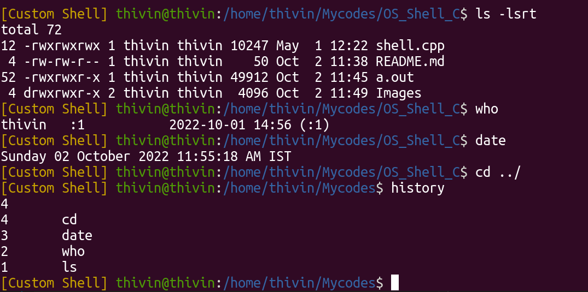
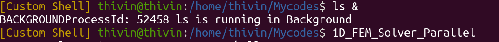

# Bash Like Shell using C
---
This program creates a bash like shell enviroinment variable which parses the users inputs and runs them using the inbuilt funcitons within C like `execvp` , `fork`, `execute` etc


## Compilation Instructions
---

Compile the C++ file using 

```
g++ --std=c++11 shell.cpp
```

and run the command 

```
./a.out
```


## Features of Shell
---

### Display Active Directory 
---

Like an actual shell, it will display the user name and the Current Directory that the user is in. It also changes the directory, when the user changes the active directory and also supports commands like `cd ` and `cd ../`. 

It Also gives a warning, when the prescribed directory does not exist. 



### History
---

It has features to save the history of ommmands that have been entered by the user and the user can check these commands by entering History 



Those commands in history can be accessed using `!n` where `n` will be the `nth` command in the history


### Background Process
---

Any process can be run in background using `&` command. A message with the PID of the background process will be displayed.



